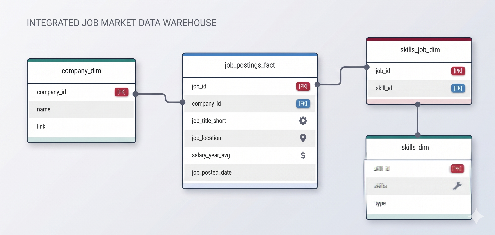

# Exploratory Data Analysis: Tech Job Market Analytics

A SQL project analyzing the Software Engineering and Machine Learning job market using real world job posting data. It demonstrates my ability to **write production-quality analytical SQL, design efficient queries, and turn business questions into data-driven insights**.

## 🧾 Executive Summary

- **Project scope:** Built **3 analytical queries** that answer key questions about the SWE and ML engineering job market.
- **Data modeling:** Used **multi-table joins** across fact and dimension tables to extract insights.
- **Analytics:** Applied **aggregations, filtering, and mathematical scoring** to find top skills by demand, salary, and overall market value.
- **Outcomes:** Delivered **actionable insights** on Python's market dominance, the premium on cloud architecture, and the optimal balance of high-paying backend languages like Go and C++.

## 🧩 Problem & Context

Job market analysts and job seekers need to answer questions like:

- **Most in-demand:** _Which skills are most frequently requested for SWE and ML roles?_
- **Highest paid:** _Which technical skills command the highest premium in the market?_
- **Best trade-off:** _What is the optimal skill set balancing widespread demand and top-tier compensation?_

This project analyzes a **data warehouse** built using a star schema design. The warehouse structure consists of:

- **Fact Table:** `job_postings_fact` - Central table containing job posting details (job titles, locations, salaries, dates, etc.)
- **Dimension Tables:**
  - `company_dim` - Company information linked to job postings
  - `skills_dim` - Skills catalog with skill names and types
- **Bridge Table:** `skills_job_dim` - Resolves the many-to-many relationship between job postings and skills

By querying across these interconnected tables, I extracted insights about skill demand, salary patterns, and optimal skill combinations to maximise career ROI.
